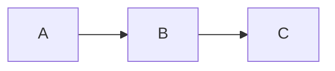

## Markdown 为什么火

Markdown 由 John Gruber 在 2004 年设计，初衷很朴素：**让人类能用易读易写的纯文本格式写作，同时能可靠地转换成 HTML**。

它解决的是富文本编辑的老问题——Word 这类所见即所得编辑器把格式藏在二进制里，文件打不开、版本难管理、不适合代码协作。Markdown 用几个简单符号表达格式（`#` 是标题、`*` 是强调、`-` 是列表），纯文本、肉眼可读、Git 友好，于是成了开发者文档、博客、笔记（Notion/Obsidian）、README 的事实标准。

预览工具的作用就是：**你写 Markdown 纯文本，它实时渲染成最终样式**，让你边写边看效果，不用等发布。

## 基础语法速览

核心元素就那几个，刻意设计得贴近邮件/纯文本的天然写法：

| 语法 | 效果 |
|------|------|
| `# 标题` ~ `######` | h1~h6 |
| `**粗体**` / `*斜体*` | 粗体 / 斜体 |
| `- 项目` 或 `1. 项目` | 无序/有序列表 |
| `[文字](url)` | 链接 |
| `` | 图片 |
| `` `代码` `` / ``` 代码块 ``` | 行内代码 / 代码块 |
| `> 引用` | 引用块 |
| `\|表格\|` | 表格（GFM 扩展） |
| `---` | 水平分隔线 |

设计哲学是"能看的源码就是格式本身"——你不用记住哪个按钮加粗，`**文字**` 自解释。

## 方言问题：为什么各平台渲染不一样

Markdown 最大的混乱是**没有唯一标准**。Gruber 的原始规范很模糊，留了大量边界未定义，于是各平台自己扩展、自己解释，形成了大量方言：

- **GFM（GitHub Flavored Markdown）**：GitHub 的方言，加了表格、任务列表 `- [ ]`、删除线 `~~`、自动链接 URL、围栏代码块。最流行的扩展集
- **CommonMark**：社区为终结混乱而做的严格标准化（明确每个边界规则），现在很多渲染器以 CommonMark 为基础再叠 GFM 扩展
- **MultiMarkdown / Pandoc Markdown**：学术写作扩展（脚注、引用、数学公式）
- **各笔记软件的私有扩展**：Notion、Obsidian 的 `[[wikilink]]`、`$$公式$$`、callout 等

后果：同一份 Markdown 在 GitHub、VSCode、博客系统渲染出来可能不同。典型差异点：

1. **表格**：原始 Markdown 不支持表格，GFM 才加。纯 CommonMark 渲染器会把表格当纯文本
2. **任务列表** `- [x]`：GFM 扩展，非 GFM 不渲染成复选框
3. **删除线** `~~`：GFM 扩展
4. **围栏代码块语言**：```` ```js ```` 的语法高亮各平台支持程度不同
5. **换行规则**：单个换行是软换行还是硬换行？CommonMark 规定单个换行=空格，需两个空格+换行或空行才换行——这点最反直觉，很多人踩坑

## 预览工具在做什么

预览器的核心是 **Markdown → HTML 的解析渲染**，再加一层 CSS 套样式。流程：

1. **解析**：用解析器（markdown-it、marked、remark 等）把 Markdown 文本转成 HTML 字符串。解析器支持哪些扩展决定了哪些语法能渲染
2. **净化（XSS 防护）**：Markdown 允许嵌套 HTML，恶意输入可以塞 `<script>`。**严肃的渲染器必须做 HTML 净化（sanitize）**，剥离危险标签和属性。本站预览在浏览器内运行并做了净化
3. **代码高亮**：对围栏代码块按语言做语法着色（highlight.js、Prism 等）
4. **样式渲染**：套 CSS 让 HTML 有美观排版

选预览工具时关注它**支持哪种方言**（GFM 兼容性如何）、**有没有做 XSS 净化**——这两点决定它能安全用在什么场景。

## Mermaid 和扩展图表

现代 Markdown 预览常支持 Mermaid——用文本描述流程图、时序图、甘特图，预览器渲染成 SVG。语法是特殊的围栏代码块：

````

````

这把 Markdown 从"文档格式"扩展到"图表工具"，写技术文档时画流程图不用再开 Visio。但 Mermaid 语法较严格，写错不报错只显示原图，预览器的价值就是实时验证语法对不对。

## 安全提醒：Markdown 里的 HTML

Markdown 设计上允许直接嵌 HTML（`<div>`、`<span>` 等不被解析直接透传）。这带来灵活性，也带来风险：

- 用户输入的 Markdown 渲染展示给别人时，嵌入的 ``、`<script>` 就是 XSS
- 所以**渲染不可信 Markdown 必须净化**（DOMPurify 之类）。但净化会牺牲部分 HTML 嵌入能力，需要权衡

自己写文档预览无所谓，但做"用户提交内容展示"的功能（评论、论坛），净化是必须的。

## 小结

Markdown 的魅力是"纯文本即格式"，但它的软肋是方言林立——同一份文本在不同平台渲染不同，根源是原始规范模糊导致的扩展分化。选预览工具看两点：方言支持（GFM 兼容性）和 XSS 净化。理解了换行规则、表格/任务列表等扩展的来源，你就能解释"为什么我写的 Markdown 在这能显示在那不能"这类困惑。
